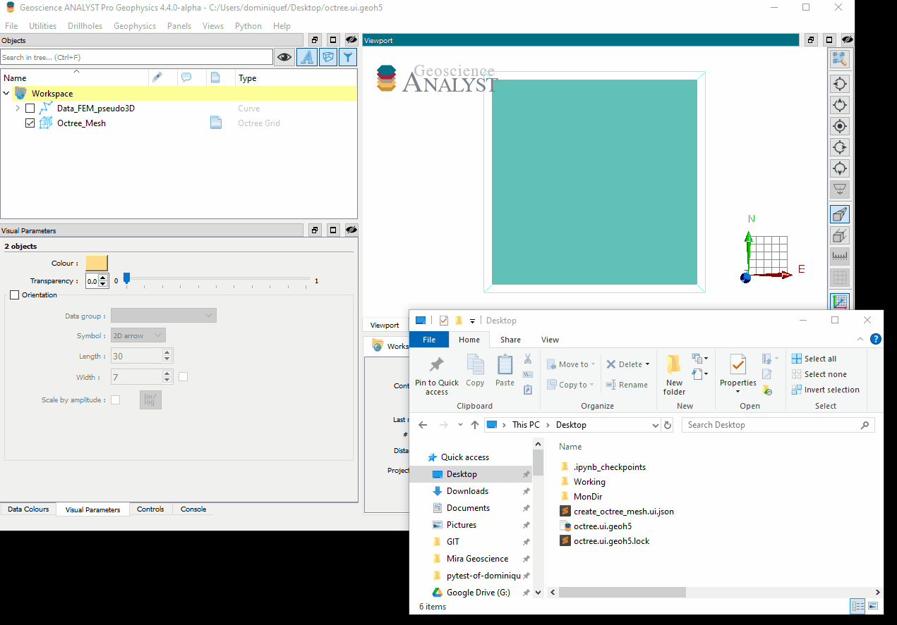
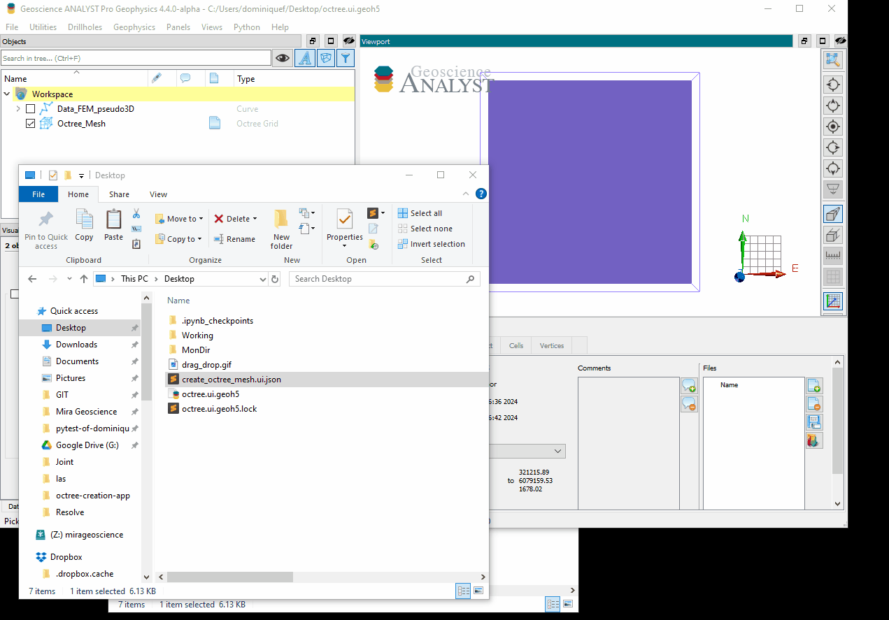

.. _usage:

Basic usage
===========

The main entry point is the ``ui.json`` file (stored under the ``grid_apps-assets`` directory).
The ``ui.json`` has the dual purpose of (1) rendering a user-interface from Geoscience ANALYST and (2) storing the input
parameters chosen by the user for the program to run. To learn more about the ui.json interface visit the
`UIJson documentation <https://mirageoscience-geoh5py.readthedocs-hosted.com/en/stable/content/uijson_format/usage.html#usage-with-geoscience-analyst-pro>`_ page.

User-interface
--------------

The user-interface is rendered in ANALYST Pro by one of two methods.
Users can either drag-and-drop the ui.json file to the viewport:

Alternatively, users can add the application to the choice list of ANALYST-Python scripts:

Note that ANALYST needs to be restarted for the changes to take effect.

From command line
-----------------

The application can also be run from the command line if all required fields in the ui.json are provided.
This is useful for more advanced users wanting to automate the mesh creation process or re-run an existing mesh with different parameters.

To run the application from the command line, use the following command in a Conda Prompt:

``conda activate grid_apps``

``python -m grid_apps.driver input_file.ui.json``

where ``input_file.json`` is the path to the input file on disk.
